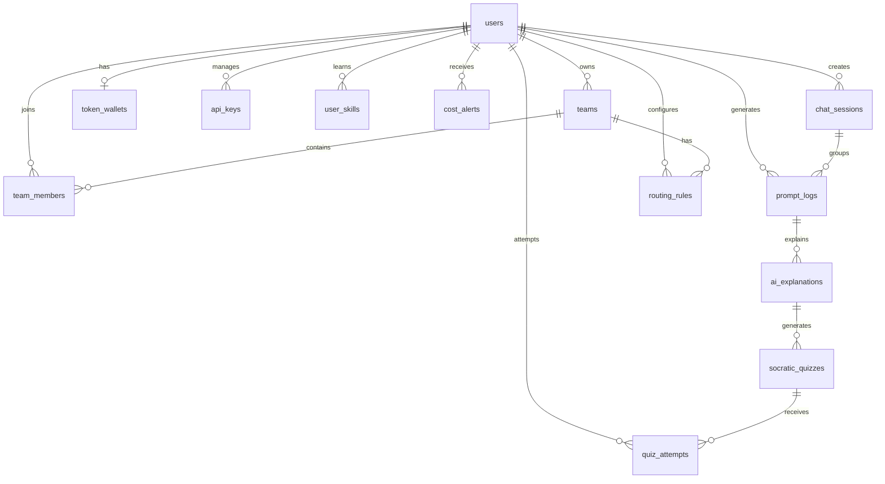

<p align="center">
  
  
  
  
  
  
  
</p>

<h1 align="center">⚡ CostOps</h1>
<h3 align="center">AI Prompt Optimization & Cost Management Gateway</h3>

<p align="center">
  <em>Nền tảng quản lý chi phí AI thông minh — tự động tối ưu hóa prompt, định tuyến mô hình,<br/>kiểm soát ngân sách token và phát hiện rò rỉ chi phí theo thời gian thực.</em>
</p>

---

## 📖 Mục Lục

- [Tổng Quan Dự Án](#-tổng-quan-dự-án)
- [Tính Năng Nổi Bật](#-tính-năng-nổi-bật)
- [Kiến Trúc Hệ Thống](#-kiến-trúc-hệ-thống)
- [Công Nghệ Sử Dụng](#-công-nghệ-sử-dụng)
- [Cấu Trúc Thư Mục](#-cấu-trúc-thư-mục)
- [Pipeline Tối Ưu Hóa Prompt](#-pipeline-tối-ưu-hóa-prompt)
- [Lược Đồ Cơ Sở Dữ Liệu](#-lược-đồ-cơ-sở-dữ-liệu)
- [API Endpoints](#-api-endpoints)
- [Yêu Cầu Hệ Thống](#-yêu-cầu-hệ-thống)
- [Hướng Dẫn Cài Đặt & Chạy](#-hướng-dẫn-cài-đặt--chạy)
  - [Cách 1: Docker Compose (Khuyên Dùng)](#-cách-1-docker-compose-khuyên-dùng)
  - [Cách 2: Chạy Thủ Công](#-cách-2-chạy-thủ-công-development)
- [Biến Môi Trường](#-biến-môi-trường)
- [Kiểm Tra & Thử Nghiệm](#-kiểm-tra--thử-nghiệm)
- [Giao Diện Frontend](#-giao-diện-frontend)
- [Đóng Góp](#-đóng-góp)
- [Giấy Phép](#-giấy-phép)

---

## 🎯 Tổng Quan Dự Án

**CostOps** là một **API Gateway trung gian** đặt giữa ứng dụng của bạn và các nhà cung cấp LLM (OpenAI, Anthropic, DeepSeek, Google Gemini). Thay vì gửi prompt thô trực tiếp, CostOps sẽ:

1. **Chặn lại** mọi request tới LLM
2. **Tối ưu hóa** prompt bằng pipeline nén ngữ nghĩa 3 giai đoạn
3. **Định tuyến thông minh** tới model có chi phí thấp nhất phù hợp với độ phức tạp
4. **Chuyển tiếp** request đã tối ưu tới nhà cung cấp upstream
5. **Ghi lại** toàn bộ lịch sử sử dụng, chi phí và mức tiết kiệm

> **Mục tiêu cốt lõi:** Giảm tối đa chi phí sử dụng AI mà không làm giảm chất lượng phản hồi, đồng thời cung cấp khả năng giám sát và kiểm soát ngân sách toàn diện cho cá nhân và nhóm.

---

## ✨ Tính Năng Nổi Bật

### 🧠 Tối Ưu Hóa Prompt Thông Minh
| Tính năng | Mô tả |
|---|---|
| **Dynamic Semantic Compiler** | Sử dụng Gemini 2.5 Flash để phân tích ý định prompt và tái cấu trúc thành dạng tối ưu token nhất |
| **Nén Regex đa lớp** | Loại bỏ comment, filler phrases, whitespace thừa qua 4 bước nén tự động |
| **Template Standardizer** | Chuẩn hóa prompt thành template chuẩn (`[SYSTEM]`, `[CONTEXT]`, `[QUESTION]`...) để tăng hiệu quả cache |
| **Fallback Rule-Based** | Khi không có API key Gemini, tự động dùng bộ quy tắc regex để nén prompt |

### 🔀 Định Tuyến Model Thông Minh (Smart Router)
| Chiến lược | Điều kiện | Model được chọn |
|---|---|---|
| `short_prompt_cheapest` | Prompt < 500 ký tự | Model rẻ nhất (DeepSeek Chat) |
| `medium_prompt_balanced` | Prompt 500–2000 ký tự | Model tầm trung (Claude Haiku) |
| `long_prompt_capable` | Prompt > 2000 ký tự | Model mạnh nhất (GPT-4 Turbo) |
| `user_hint` | Người dùng chỉ định | Tôn trọng lựa chọn người dùng |

### 💰 Quản Lý Ngân Sách & Ví Token
- **Token Wallet** — Mỗi user có ví token riêng với hạn mức ngày/tháng
- **Team Budget Isolation** — Ngân sách nhóm cách ly, thành viên dùng token từ ví chủ nhóm
- **Quota Guard Middleware** — Chặn request khi vượt hạn mức, trả HTTP 429/403
- **Auto Reset Cycle** — Tự động reset hạn mức sử dụng theo chu kỳ 30 ngày

### 🔍 Phát Hiện Rò Rỉ Chi Phí (Leak Detection)
- **Content Bloat Detection** — Cảnh báo khi prompt vượt 50,000 tokens (payload abuse)
- **Infinite Loop Detection** — Phát hiện > 10 request/phút từ cùng user (vòng lặp AI agent)
- **Anti-Spam Alert** — Chống gửi alert trùng lặp trong cùng khung thời gian

### 🔐 Xác Thực & Bảo Mật
- **JWT Authentication** — Xác thực Bearer Token chuẩn
- **API Key Authentication** — Hỗ trợ key dạng `costops_key_*` với SHA-256 hash
- **Development Bypass** — Tự động bypass auth ở môi trường development
- **CORS Middleware** — Cấu hình đầy đủ cho cross-origin requests

### 📊 Dashboard & Giám Sát
- **Real-time WebSocket** — Cập nhật ví token và metrics theo thời gian thực
- **Usage Analytics** — Thống kê chi phí, token tiết kiệm, lịch sử sử dụng
- **Audit History** — Nhật ký kiểm toán toàn bộ prompt đã đi qua pipeline
- **Prompt Diff View** — So sánh trực quan prompt gốc vs đã tối ưu

---

## 🏗 Kiến Trúc Hệ Thống

```
                    ┌─────────────────────────────────────────────────────┐
                    │                  NGINX (Port 80)                    │
                    │              Reverse Proxy + Load Balancer          │
                    └──────┬──────────────┬──────────────┬───────────────┘
                           │              │              │
                    /v1/*  │       /api/*  │       /ws/*  │
                           │              │              │
              ┌────────────▼────┐  ┌──────▼──────┐      │
              │   GATEWAY       │  │  BACKEND    │      │
              │  (FastAPI)      │  │  (NestJS)   │      │
              │  Port 8000      │  │  Port 3000  │      │
              │                 │  │             │      │
              │ ┌─────────────┐ │  │ • Auth      │      │
              │ │  Pipeline   │ │  │ • Users     │      │
              │ │  ┌────────┐ │ │  │ • Teams     │      │
              │ │  │ Router │ │ │  │ • Wallet    │      │
              │ │  │Compress│ │ │  │ • Analytics │      │
              │ │  │Standar.│ │ │  └──────┬──────┘      │
              │ │  └────────┘ │ │         │             │
              │ └─────────────┘ │         │             │
              │                 │         │             │
              │ • Auth MW       │         │             │
              │ • Quota Guard   │         │             │
              │ • Leak Detect   │         │             │
              │ • WebSocket     │         │             │
              │ • Cache Service │         │             │
              └────────┬───────┘         │             │
                       │                  │             │
            ┌──────────▼──────────────────▼─────────────▼───┐
            │              PostgreSQL 16                      │
            │         (Cơ sở dữ liệu chính — 12 bảng)       │
            └────────────────────┬───────────────────────────┘
                                 │
            ┌────────────────────▼───────────────────────────┐
            │              Redis 7                            │
            │    (Cache, Rate Limiting, Session Store)        │
            └────────────────────────────────────────────────┘


              ┌──────────────────────────────────────────────┐
              │             FRONTEND                          │
              │         (React + Vite + TailwindCSS)          │
              │            Port 5173                          │
              │                                              │
              │  Pages:                                      │
              │  • Dashboard  — Tổng quan KPI & biểu đồ      │
              │  • Playground — Chat AI & test prompt         │
              │  • History    — Nhật ký kiểm toán            │
              │  • Teams      — Quản lý nhóm & thành viên    │
              │                                              │
              │  Components:                                 │
              │  • TokenBar   — Thanh hiển thị ngân sách      │
              │  • UsageChart — Biểu đồ sử dụng             │
              │  • PromptDiff — So sánh prompt               │
              │  • LeakDiag   — Cảnh báo rò rỉ              │
              └──────────────────────────────────────────────┘
```

### Luồng Xử Lý Request (Chat Completions Flow)

```
 Client Request                                             Upstream LLM
      │                                                          ▲
      ▼                                                          │
 ┌─────────┐   ┌──────────┐   ┌───────────┐   ┌──────────────┐  │
 │  Auth    │──▶│  Quota   │──▶│ Pipeline  │──▶│   Provider   │──┘
 │Middleware│   │  Guard   │   │  Engine   │   │   Adapter    │
 └─────────┘   └──────────┘   │           │   │(OpenAI/Gemini│
                               │ 1.Route   │   │ DeepSeek/    │
                               │ 2.Compress│   │ Anthropic)   │
                               │ 3.Standar.│   └──────────────┘
                               └─────┬─────┘
                                     │
                              ┌──────▼──────┐
                              │ Background  │
                              │   Task      │
                              │• Wallet Debit│
                              │• PromptLog  │
                              │• Leak Check │
                              │• WS Notify  │
                              └─────────────┘
```

---

## 🛠 Công Nghệ Sử Dụng

### Gateway (Python)
| Thành phần | Công nghệ | Phiên bản |
|---|---|---|
| Framework | FastAPI | 0.115.6 |
| ASGI Server | Uvicorn | 0.34.0 |
| Validation | Pydantic | 2.10.4 |
| ORM | SQLAlchemy 2.0 (Async) | 2.0.36 |
| DB Driver | asyncpg | 0.30.0 |
| HTTP Client | httpx | 0.28.1 |
| Token Counter | tiktoken | 0.8.0 |
| Cache | redis-py (async) | 5.2.1 |
| JWT | python-jose | 3.3.0 |
| Password Hash | passlib + bcrypt | 1.7.4 |

### Backend (Node.js)
| Thành phần | Công nghệ | Phiên bản |
|---|---|---|
| Framework | NestJS | 10.x |
| ORM | Prisma Client | 5.12.1 |
| Validation | class-validator | 0.14.1 |
| Serialization | class-transformer | 0.5.1 |

### Frontend
| Thành phần | Công nghệ | Phiên bản |
|---|---|---|
| UI Library | React | 18.x |
| Build Tool | Vite | 4.4.5 |
| Styling | TailwindCSS | 3.4.x |
| Charts | Recharts | 2.12.0 |
| Animations | Motion (Framer) | 12.40.0 |
| Icons | Lucide React | 1.16.0 |

### Hạ Tầng
| Thành phần | Công nghệ | Phiên bản |
|---|---|---|
| Database | PostgreSQL | 16 Alpine |
| Cache/Rate Limit | Redis | 7 Alpine |
| Reverse Proxy | Nginx | 1.25 Alpine |
| Containerization | Docker Compose | 3.9 |

---

## 📁 Cấu Trúc Thư Mục

```
costops-dev/
├── 📄 .env.example              # Template biến môi trường
├── 📄 .gitignore                # Git ignore rules
├── 📄 run.bat                   # One-click launcher (Windows)
│
├── 🐍 gateway/                  # ═══ GATEWAY SERVICE (FastAPI, Python) ═══
│   ├── main.py                  # Entry point — khởi tạo app, middleware, routers
│   ├── config.py                # Centralized settings (pydantic-settings)
│   ├── database.py              # Async SQLAlchemy engine, session factory
│   ├── requirements.txt         # Python dependencies
│   ├── Dockerfile               # Container build config
│   │
│   └── app/
│       ├── middleware/
│       │   ├── auth.py          # JWT + API Key authentication middleware
│       │   └── quota_guard.py   # Rate limiting + budget enforcement
│       │
│       ├── models/
│       │   └── models.py        # 12-table SQLAlchemy ORM schema (UUID-based)
│       │
│       ├── pipeline/
│       │   ├── engine.py        # 3-stage optimization orchestrator
│       │   ├── compressor.py    # Regex-based multi-pass prompt compressor
│       │   ├── router.py        # Smart model routing (cost heuristics)
│       │   └── standardizer.py  # Template standardization engine
│       │
│       ├── providers/
│       │   ├── openai.py        # OpenAI API adapter
│       │   ├── anthropic.py     # Anthropic (Claude) adapter
│       │   ├── deepseek.py      # DeepSeek adapter
│       │   └── gemini.py        # Google Gemini adapter
│       │
│       ├── routes/
│       │   ├── chat.py          # POST /v1/chat/completions (core endpoint)
│       │   ├── usage.py         # GET /v1/usage/* (analytics data)
│       │   ├── wallet.py        # Wallet CRUD operations
│       │   ├── alerts.py        # Cost alert management
│       │   └── ws.py            # WebSocket real-time updates
│       │
│       └── services/
│           ├── token_counter.py # tiktoken-based accurate counting
│           ├── wallet_service.py# Token debit/credit business logic
│           ├── leak_detector.py # Anomaly detection engine
│           ├── cache_service.py # Redis cache abstraction
│           └── ws_service.py    # WebSocket connection manager
│
├── 📦 backend/                  # ═══ BACKEND SERVICE (NestJS, TypeScript) ═══
│   ├── package.json             # Node.js dependencies & scripts
│   ├── tsconfig.json            # TypeScript configuration
│   ├── Dockerfile               # Container build config
│   │
│   ├── prisma/
│   │   └── schema.prisma        # Prisma ORM schema (mirrors gateway models)
│   │
│   └── src/
│       ├── main.ts              # NestJS bootstrap (port 3000, prefix /api)
│       ├── app.module.ts        # Root module registration
│       │
│       ├── auth/
│       │   └── auth.service.ts  # JWT token generation & validation
│       │
│       ├── users/
│       │   ├── users.controller.ts  # User CRUD endpoints
│       │   └── users.service.ts     # User business logic
│       │
│       ├── teams/
│       │   ├── teams.controller.ts  # Team management endpoints
│       │   └── teams.service.ts     # Team + member business logic
│       │
│       ├── wallet/
│       │   ├── wallet.controller.ts # Wallet balance endpoints
│       │   └── wallet.service.ts    # Token wallet operations
│       │
│       ├── analytics/
│       │   ├── analytics.controller.ts # Analytics query endpoints
│       │   └── analytics.service.ts    # Usage statistics & reports
│       │
│       └── prisma/
│           └── prisma.module.ts # Prisma client provider
│
├── ⚛️  frontend/                # ═══ FRONTEND (React + Vite + TailwindCSS) ═══
│   ├── package.json             # Node.js dependencies & scripts
│   ├── vite.config.ts           # Vite config (proxy /v1 → gateway, /api → backend)
│   ├── tailwind.config.js       # TailwindCSS customization
│   ├── index.html               # HTML entry point
│   ├── Dockerfile               # Container build config
│   │
│   └── src/
│       ├── main.tsx             # React DOM render entry
│       ├── App.tsx              # Root component (routing, theme, navbar)
│       ├── index.css            # Global styles
│       │
│       ├── pages/
│       │   ├── Dashboard.tsx    # KPI cards, usage charts, alerts overview
│       │   ├── Playground.tsx   # AI chat interface & prompt testing
│       │   ├── History.tsx      # Audit log with prompt diff view
│       │   └── Teams.tsx        # Team creation, member mgmt, budgets
│       │
│       ├── components/
│       │   ├── TokenBar.tsx     # Budget usage progress bar
│       │   ├── UsageChart.tsx   # Recharts-based analytics visualization
│       │   ├── PromptDiff.tsx   # Side-by-side prompt comparison
│       │   └── LeakDiag.tsx     # Leak detection alert panel
│       │
│       └── hooks/
│           └── useWallet.ts     # Custom hook for wallet state + WebSocket sync
│
└── 🐳 infra/                   # ═══ INFRASTRUCTURE ═══
    ├── docker-compose.yml       # Full-stack orchestration (6 services)
    └── nginx.conf               # Reverse proxy routing rules
```

---

## 🔧 Pipeline Tối Ưu Hóa Prompt

Pipeline CostOps xử lý mỗi prompt qua **3 giai đoạn tuần tự**:

### Giai Đoạn 1: Smart Routing 🔀
> Chọn nhà cung cấp và model có chi phí tối ưu nhất.

```python
# Bảng giá (USD / 1K tokens)
MODEL_CATALOG = {
    "openai":    {"gpt-4o": $0.005,  "gpt-4o-mini": $0.00015, "gpt-4-turbo": $0.01},
    "anthropic": {"claude-sonnet-4": $0.003, "claude-3-haiku": $0.00025},
    "deepseek":  {"deepseek-chat": $0.00014, "deepseek-coder": $0.00014},
    "gemini":    {"gemini-2.5-flash": $0.0014},
}
```

### Giai Đoạn 2: Prompt Compression 🗜️
> Nén prompt bằng Dynamic Semantic Compiler (Gemini 2.5 Flash).

- Sử dụng LLM để phân tích ý định và tái cấu trúc prompt
- Phân loại tự động: Feature Request → `[Core Goal]`, Debugging → `[Error Context]`, General → `[Objective]`
- Fallback sang regex rule-based nếu không có API key

### Giai Đoạn 3: Template Standardization 📐
> Chuẩn hóa prompt thành dạng canonical để tăng cache hit rate.

- Nhận diện section markers: `system:`, `context:`, `question:`, `instruction:`
- Chuyển đổi thành tags chuẩn: `[SYSTEM]`, `[CONTEXT]`, `[QUESTION]`, `[INSTRUCTION]`
- Loại bỏ padding và normalize line endings

### Ví Dụ Minh Họa

```diff
─── TRƯỚC (280 ký tự, 67 tokens) ──────────────────────
  "Chào bạn, viết hộ tôi cái function login bằng React 
   TypeScript, mà nhớ là phải có validation email nha, 
   cảm ơn bạn rất nhiều. Nhớ làm kĩ nha..."

─── SAU (95 ký tự, 22 tokens) ─────────────────────────
+ **[Core Goal]**
+ Login function — React/TypeScript — email validation
+
+ **[Tech Stack]**
+ React/TypeScript
+
+ **[Logic Gates]**
+ Clean implementation with responsive layout

📊 Tiết kiệm: 67% tokens → Giảm ~67% chi phí API
```

---

## 🗄 Lược Đồ Cơ Sở Dữ Liệu

Hệ thống sử dụng **12 bảng** với khóa chính UUID đồng nhất:



### Bảng Chi Tiết

| # | Bảng | Mô tả | Quan hệ chính |
|---|---|---|---|
| 1 | `users` | Tài khoản người dùng (email, password hash, role) | Root entity |
| 2 | `teams` | Nhóm tổ chức với ngân sách token chung | `owner_id` → users |
| 3 | `team_members` | Liên kết nhiều-nhiều giữa users và teams | Composite PK |
| 4 | `token_wallets` | Ví token: hạn mức ngày, đã dùng, tổng all-time | 1:1 với users |
| 5 | `api_keys` | Quản lý API Key (hash SHA-256, trạng thái active) | N:1 với users |
| 6 | `routing_rules` | Quy tắc định tuyến tùy chỉnh theo user/team | FK users + teams |
| 7 | `chat_sessions` | Phiên hội thoại nhóm nhiều prompt log | FK users |
| 8 | `prompt_logs` | Audit log: prompt gốc, đã tối ưu, token, chi phí | FK users + sessions |
| 9 | `ai_explanations` | Giải thích khái niệm từ AI | FK prompt_logs |
| 10 | `socratic_quizzes` | Câu hỏi quiz từ explanations (JSON options) | FK ai_explanations |
| 11 | `quiz_attempts` | Lịch sử làm quiz của user | FK users + quizzes |
| 12 | `cost_alerts` | Cảnh báo rò rỉ chi phí + vượt ngân sách | FK users |

---

## 🌐 API Endpoints

### Gateway (Port 8000 — Prefix `/v1`)

| Method | Endpoint | Mô tả |
|--------|----------|-------|
| `GET` | `/health` | Health check (liveness probe) |
| `POST` | `/v1/chat/completions` | ⭐ **Core** — OpenAI-compatible chat (stream + non-stream) |
| `POST` | `/v1/prompt/optimize` | Chạy pipeline tối ưu hóa mà không gọi upstream |
| `GET` | `/v1/chat/conversations` | Danh sách phiên hội thoại |
| `GET` | `/v1/chat/conversations/{id}` | Chi tiết hội thoại + prompt logs |
| `GET` | `/v1/usage/*` | Thống kê sử dụng & analytics |
| `*` | `/v1/wallet/*` | Quản lý ví token (balance, debit, credit) |
| `*` | `/v1/alerts/*` | Quản lý cảnh báo chi phí |
| `WS` | `/ws/{user_id}` | WebSocket real-time updates |
| `GET` | `/v1/docs` | Swagger UI tương tác |
| `GET` | `/v1/openapi.json` | OpenAPI specification |

### Backend (Port 3000 — Prefix `/api`)

| Method | Endpoint | Mô tả |
|--------|----------|-------|
| `*` | `/api/users/*` | CRUD người dùng |
| `*` | `/api/teams/*` | Quản lý nhóm & thành viên |
| `*` | `/api/wallet/*` | Ví token — xem số dư, nạp/rút |
| `*` | `/api/analytics/*` | Thống kê & báo cáo sử dụng |

---

## 💻 Yêu Cầu Hệ Thống

### Cách 1: Docker (Khuyên dùng)
- **Docker Desktop** phiên bản 4.x trở lên
- **Docker Compose** v2
- **RAM** tối thiểu 4 GB khả dụng

### Cách 2: Chạy thủ công
- **Python** 3.11+
- **Node.js** 18+ & npm
- **PostgreSQL** 16 đang chạy
- **Redis** 7 đang chạy

---

## 🚀 Hướng Dẫn Cài Đặt & Chạy

### 📋 Bước 0: Chuẩn Bị File `.env` (Bắt Buộc)

Sao chép file cấu hình mẫu và điền API key:

```powershell
# Di chuyển tới thư mục dự án
cd "d:\system integration\costop\costops-dev"

# Sao chép template
Copy-Item .env.example .env
```

Mở file `.env` và cập nhật các giá trị:

```env
# ── API Keys (điền key thật của bạn) ──
OPENAI_API_KEY=sk-xxxxxxxxxxxxxxxxxxxxxxxx
ANTHROPIC_API_KEY=sk-ant-xxxxxxxxxxxxxxxx
DEEPSEEK_API_KEY=sk-xxxxxxxxxxxxxxxxxxxxxxxx
GEMINI_API_KEY=AIzaxxxxxxxxxxxxxxxxxxxxxxxxx

# ── Auth ──
JWT_SECRET=your_super_secret_jwt_key_here
```

> **📝 Lưu ý:** Nếu không điền API key, bạn vẫn có thể chạy toàn bộ hệ thống. Tuy nhiên, các request chat tới LLM sẽ trả về lỗi từ phía nhà cung cấp. Các tính năng khác (dashboard, wallet, teams) vẫn hoạt động bình thường.

---

### 🐳 Cách 1: Docker Compose (Khuyên Dùng)

Khởi động toàn bộ 6 service bằng **một lệnh duy nhất**:

```powershell
cd "d:\system integration\costop\costops-dev\infra"
docker-compose up --build -d
```

Hoặc sử dụng **one-click launcher**:
```powershell
cd "d:\system integration\costop\costops-dev"
.\run.bat
```

Lệnh này sẽ tự động:
1. ✅ Tải và khởi chạy **PostgreSQL 16** (cơ sở dữ liệu)
2. ✅ Tải và khởi chạy **Redis 7** (cache, rate limiter)
3. ✅ Build và chạy **Gateway** (FastAPI — port 8000)
4. ✅ Build và chạy **Backend** (NestJS — port 3000)
5. ✅ Build và chạy **Frontend** (Vite dev server — port 5173)
6. ✅ Cấu hình **Nginx** reverse proxy (port 80)

#### Các URL truy cập:

| Dịch vụ | URL | Mô tả |
|---------|-----|-------|
| 🌐 Frontend | http://localhost:5173 | Dashboard & Playground |
| 📖 API Docs | http://localhost:8000/v1/docs | Swagger UI tương tác |
| 🔌 Gateway API | http://localhost:8000 | FastAPI Gateway |
| 📡 Backend API | http://localhost:3000 | NestJS Backend |
| 🔄 Nginx Proxy | http://localhost:80 | Unified entry point |

#### Dừng tất cả services:
```powershell
cd "d:\system integration\costop\costops-dev\infra"
docker-compose down
```

#### Xoá dữ liệu và reset hoàn toàn:
```powershell
docker-compose down -v   # Xoá cả volumes (database data)
```

---

### 💻 Cách 2: Chạy Thủ Công (Development)

Phù hợp khi bạn muốn debug hoặc phát triển từng service riêng biệt.

#### Bước 1: Khởi chạy Database & Redis

```powershell
cd "d:\system integration\costop\costops-dev\infra"
docker-compose up -d postgres redis
```

#### Bước 2: Chạy Gateway (Python FastAPI)

```powershell
cd "d:\system integration\costop\costops-dev\gateway"

# Tạo môi trường ảo Python
python -m venv venv
.\venv\Scripts\Activate.ps1

# Cài đặt dependencies
pip install -r requirements.txt

# Khởi chạy Gateway (tự động tạo bảng DB)
python main.py
```

> 🟢 Gateway chạy tại: **http://localhost:8000**
> Tất cả bảng DB được tự động khởi tạo qua `Base.metadata.create_all`

#### Bước 3: Chạy Backend (NestJS)

```powershell
cd "d:\system integration\costop\costops-dev\backend"
npm install
npm run start:dev
```

> 🟢 Backend chạy tại: **http://localhost:3000**

#### Bước 4: Chạy Frontend (React + Vite)

```powershell
cd "d:\system integration\costop\costops-dev\frontend"
npm install
npm run dev
```

> 🟢 Frontend chạy tại: **http://localhost:5173**
> Tự động proxy `/v1` → Gateway, `/api` → Backend

---

## 🔑 Biến Môi Trường

| Biến | Mặc định | Mô tả |
|------|----------|-------|
| `POSTGRES_USER` | `costops` | Tên người dùng PostgreSQL |
| `POSTGRES_PASSWORD` | `costops_secret` | Mật khẩu PostgreSQL |
| `POSTGRES_DB` | `costops_db` | Tên database |
| `DATABASE_URL` | `postgresql+asyncpg://...` | Connection string đầy đủ |
| `REDIS_URL` | `redis://localhost:6379/0` | Redis connection URL |
| `OPENAI_API_KEY` | — | API key OpenAI |
| `ANTHROPIC_API_KEY` | — | API key Anthropic (Claude) |
| `DEEPSEEK_API_KEY` | — | API key DeepSeek |
| `GEMINI_API_KEY` | — | API key Google Gemini |
| `JWT_SECRET` | `changeme_jwt_secret_key` | Secret key cho JWT tokens |
| `JWT_ALGORITHM` | `HS256` | Thuật toán JWT |
| `JWT_EXPIRATION_MINUTES` | `1440` | Thời gian hết hạn token (phút) |
| `GATEWAY_URL` | `http://localhost:8000` | URL gateway cho backend |
| `NODE_ENV` | `development` | Môi trường Node.js |
| `ENVIRONMENT` | `development` | Môi trường chung |
| `LOG_LEVEL` | `info` | Mức log (`debug`, `info`, `warning`, `error`) |

---

## 🧪 Kiểm Tra & Thử Nghiệm

### Health Check

```powershell
Invoke-RestMethod -Uri "http://localhost:8000/health" -Method Get
```

Kết quả mong đợi:
```json
{
  "status": "ok",
  "service": "costops-gateway"
}
```

### Test Chat Completions (Streaming)

```powershell
$headers = @{
    "Content-Type" = "application/json"
}

$body = @{
    model = "gpt-4o"
    messages = @(
        @{ role = "user"; content = "Giải thích Docker Compose là gì?" }
    )
    stream = $true
} | ConvertTo-Json -Depth 5

Invoke-RestMethod -Uri "http://localhost:8000/v1/chat/completions" `
    -Method Post -Headers $headers -Body $body
```

### Test Prompt Optimization (Standalone)

```powershell
$body = @{
    raw_prompt = "Chào bạn, viết hộ tôi cái function login bằng React TypeScript, mà nhớ là phải có validation email nha, cảm ơn bạn rất nhiều."
} | ConvertTo-Json

Invoke-RestMethod -Uri "http://localhost:8000/v1/prompt/optimize" `
    -Method Post -Headers @{"Content-Type"="application/json"} -Body $body
```

---

## 🎨 Giao Diện Frontend

Frontend được thiết kế với phong cách **Dark Glassmorphism** cao cấp, hỗ trợ 3 chế độ giao diện:

| Chế độ | Mô tả |
|--------|-------|
| ☀️ **Light** | Giao diện sáng, nền trắng sang trọng |
| 🌙 **Dark** | Giao diện tối với hiệu ứng glassmorphism |
| 🖥️ **System** | Tự động theo cài đặt hệ điều hành |

### Các trang chính:

| Trang | Chức năng |
|-------|-----------|
| **Dashboard** | Tổng quan KPI (tokens tiết kiệm, chi phí, compression ratio), biểu đồ sử dụng theo thời gian, cảnh báo rò rỉ |
| **Playground** | Giao diện chat AI với streaming real-time, hiển thị prompt diff (trước/sau tối ưu), chọn model/provider |
| **Audit History** | Nhật ký kiểm toán đầy đủ — xem prompt gốc, đã tối ưu, model sử dụng, token tiết kiệm, chi phí ước tính |
| **Workspace Teams** | Tạo và quản lý nhóm, mời/xóa thành viên, phân bổ hạn mức token, giám sát sử dụng nhóm |

---

## 🤝 Đóng Góp

Dự án được phát triển cho mục đích **System Integration Capstone**. Mọi đóng góp và góp ý đều được hoan nghênh!

1. Fork repository
2. Tạo feature branch (`git checkout -b feature/tinh-nang-moi`)
3. Commit changes (`git commit -m 'Thêm tính năng mới'`)
4. Push branch (`git push origin feature/tinh-nang-moi`)
5. Tạo Pull Request

---

## 📄 Giấy Phép

Dự án này là **UNLICENSED** — được phát triển cho mục đích học thuật và nghiên cứu.

---

<p align="center">
  <sub>Được xây dựng với ❤️ bởi nhóm CostOps — System Integration Capstone Project</sub>
</p>
